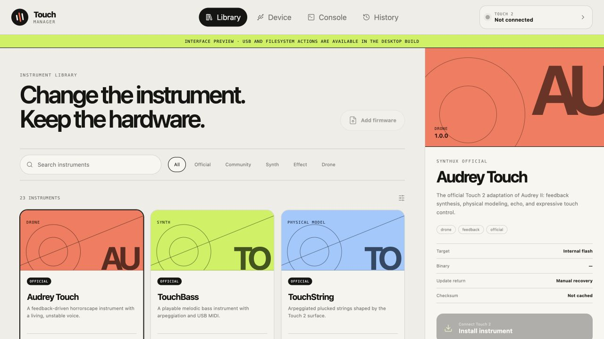

# Touch Manager

Touch Manager is a desktop firmware library, safe installer, and diagnostic console for
the [Synthux Touch 2](https://www.synthux.academy/). It turns the command-line DFU
workflow into a clear, profile-aware interface without removing the board's permanent
BOOT/RESET recovery path.



> [!IMPORTANT]
> Touch Manager is pre-release software that writes firmware to hardware. Keep USB power
> connected during an installation and retain a known-good firmware binary. Automated
> tests never write to a connected device.

## What works in 0.3

- Bundled metadata for 23 official and community Touch 2 instruments.
- On-demand downloading and verified local caching for redistributable official firmware.
- Searchable firmware library with trust, provenance, target, and checksum information.
- Raw `.bin` import and local Cortex-M vector-table analysis.
- SHA-256, size, Thumb-vector, stack-pointer, and execution-layout validation.
- Fixed profiles for STM32 internal flash, Daisy `BOOT_SRAM`, and Daisy `BOOT_QSPI`.
- Detection of runtime USB, STM32 ROM DFU, Daisy Bootloader DFU, and serial ports.
- Profile-specific update instructions and a built-in, version-checked flashing engine.
- Runtime-return detection, recovery-aware results, and SQLite install history.
- USB serial diagnostics and support-transcript export.
- Responsive macOS-first interface built with Tauri, React, TypeScript, and Rust.

The full architecture, threat model, target profiles, TouchLink proposal, and phased
roadmap are in [BUILD_PLAN.md](BUILD_PLAN.md).

## Download

Download the latest macOS installer from
[GitHub Releases](https://github.com/alibros/touch-manager/releases).

The current preview is built for Apple Silicon Macs and is fully self-contained: its
flashing engine is included in the application, so Homebrew and Terminal setup are not
required. It is ad-hoc signed rather than Apple-notarized, so first launch may require
Control-clicking the app, choosing **Open**, or approving it in **System Settings →
Privacy & Security**.

Release builds can download the eight official firmware binaries whose upstream MIT
licenses permit redistribution. Every download is checked against its catalog SHA-256 and
target profile before it enters the local cache. TouchBass 1.0.2 remains source-only until
its upstream repository includes a redistribution license.

Community entries link to their upstream source and the
[community-maintained Simple Touch 2 directory](https://github.com/Synthux-Academy/awesome-synthux#simple-touch-2),
rather than mirroring binaries with unspecified licenses.

## Safety model

The frontend cannot supply a shell command, arbitrary address, or DFU alternate setting.
The Rust backend accepts only compiled-in target profiles and validates the binary again
immediately before launching `dfu-util`. It refuses ambiguous devices, checksum failures,
unknown memory layouts, and mismatched STM32/Daisy update modes.

Touch Manager does not write option bytes, change readout protection, or mass-erase a
device. The STM32 BOOT/RESET gesture remains the recovery mechanism.

## Development setup

Prerequisites:

- macOS, Windows, or Linux with the [Tauri 2 prerequisites](https://v2.tauri.app/start/prerequisites/)
- Node.js 20.19 or newer
- Current stable Rust
- `dfu-util` 0.11 or newer for local development only; release builds include it

On macOS:

```sh
brew install dfu-util
npm ci
npm run tauri dev
```

Frontend-only preview:

```sh
npm run dev
```

## Optional firmware workspace

Developers can additionally resolve staged binaries from a Synthux workspace containing
`Firmware/SHA256SUMS.txt`. Normal users do not need this workspace to download the eight
licensed official releases or import their own `.bin` file.

Resolution order:

1. `SYNTHUX_WORKSPACE`
2. An ancestor of the current working directory

For a custom checkout location, set the workspace explicitly when starting the development
build:

```sh
export SYNTHUX_WORKSPACE=/absolute/path/to/synthux
npm run tauri dev
```

Imported `.bin` files work without this workspace, but are marked as local and unreviewed.
Do not redistribute third-party firmware without checking its upstream license.

## Verification

```sh
npm test
npm run build
(cd src-tauri && cargo fmt --all -- --check)
```

The local golden test verifies all 23 staged artifacts when a firmware workspace is
available. In a standalone CI checkout, catalog schema and metadata are still tested
without requiring or redistributing those binaries.

## Native builds

```sh
npm run tauri -- build
```

Current macOS downloads are clearly labelled development previews. A polished stable
release still requires Apple Developer ID signing and notarization. Windows releases need
explicit WinUSB guidance, and Linux releases need narrow udev rules; those distribution
tasks remain on the roadmap.

The tagged macOS release workflow builds `dfu-util` 0.11 and `libusb` 1.0.30 from their
checksum-pinned sources, statically links them, verifies that no non-system dynamic
libraries remain, and embeds the executable in the application bundle. Both corresponding
source archives and the required license notices ship with every release. See
[third-party notices](docs/THIRD_PARTY_NOTICES.md).

## Buttonless updates

The application contains the host-side TouchLink update request. Existing instruments do
not yet implement its acknowledgement and reset handler, so they continue to use the
guided physical update sequence. Buttonless updates require rebuilding maintained
firmware with the versioned TouchLink protocol described in the build plan.

## Contributing

Read [CONTRIBUTING.md](CONTRIBUTING.md) before opening a pull request. Hardware-writing
changes need an especially clear safety argument and must keep the physical recovery path
available. Please report security-sensitive problems according to [SECURITY.md](SECURITY.md).

## License

Touch Manager is available under the [MIT License](LICENSE). Firmware listed in the
catalog remains subject to each upstream project's own license.
